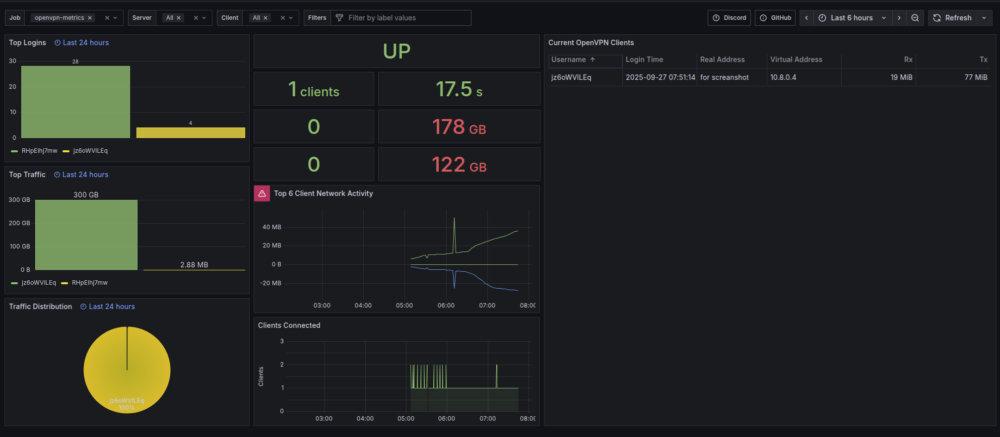

# OpenVPN Prometheus Exporter v2.0.3

[](https://github.com/B4DCATs/openvpn_exporter/pkgs/container/openvpn_exporter)
[](https://python.org)
[](LICENSE)
[](https://discord.gg/VMKdhujjCW)
[](https://github.com/B4DCATs/openvpn_exporter)

## 📊 Dashboard Preview



---

## 🚀 Quick Start

### One-Command Setup

```bash
# Download and run the quick-start script
curl -sSL https://raw.githubusercontent.com/B4DCATs/openvpn_exporter/main/quick-start.sh | bash
```

### Manual Setup

```bash
# Download docker-compose.yml
curl -O https://raw.githubusercontent.com/B4DCATs/openvpn_exporter/main/docker-compose.yml

# Start the exporter
docker compose up -d
```

**Metrics available at:** `http://localhost:9176/metrics`

---

## 🔒 Security Features

### IP Access Control

Restrict metrics access to specific IP addresses:

```bash
# Allow access only from specific IPs
export ALLOWED_IPS="192.168.1.100,10.0.0.50,monitoring-server.local"
docker compose up -d
```

### Built-in Security

- **Rate Limiting**: Protection against abuse and DDoS attacks
- **Input Validation**: All inputs validated and sanitized
- **Path Traversal Protection**: Prevents directory traversal attacks
- **Secure Logging**: Structured logging with sensitive data protection
- **Non-root Container**: Runs as non-privileged user in Docker

---

## 📈 Monitoring Setup

### Grafana Dashboard

Import the included `dashboard.json` into Grafana:

1. **Download dashboard:**
   ```bash
   curl -O https://raw.githubusercontent.com/B4DCATs/openvpn_exporter/main/dashboard.json
   ```

2. **Import in Grafana:**
   - Go to Grafana → Dashboards → Import
   - Upload `dashboard.json` or paste the content
   - Select your Prometheus datasource

3. **Dashboard Features:**
   - Real-time client monitoring
   - Traffic statistics and trends
   - Connection time tracking
   - Server health indicators
   - Security alerts and notifications

### Prometheus Configuration

Add to your `prometheus.yml`:

```yaml
scrape_configs:
  - job_name: 'openvpn-exporter'
    static_configs:
      - targets: ['your-server:9176']
    scrape_interval: 30s
    metrics_path: /metrics
```

### Complete Monitoring Stack

Run Prometheus + Grafana + OpenVPN Exporter together:

```bash
# Download complete stack
curl -O https://raw.githubusercontent.com/B4DCATs/openvpn_exporter/main/examples/config/docker-compose.full.yml

# Start monitoring stack
docker compose -f docker-compose.full.yml up -d
```

**Access:**
- Prometheus: `http://localhost:9090`
- Grafana: `http://localhost:3000` (admin/admin)
- OpenVPN Exporter: `http://localhost:9176/metrics`

---

## 🛠️ Prerequisites

### OpenVPN Server Setup

If you don't have an OpenVPN server, use the excellent [openvpn-install](https://github.com/angristan/openvpn-install) script:

```bash
curl -O https://raw.githubusercontent.com/angristan/openvpn-install/master/openvpn-install.sh
chmod +x openvpn-install.sh
./openvpn-install.sh
```

### Status File Configuration

Ensure your OpenVPN server creates a status file:

```bash
# Add to your OpenVPN server config
status /var/log/openvpn/status.log 30
```

**Common status file locations:**
- `/var/log/openvpn/status.log` (most common)
- `/var/log/openvpn/server.status`
- `/var/log/openvpn/openvpn-status.log`

**Find your status file:**
```bash
find /var/log -name "*openvpn*" -type f
```

---

## ⚙️ Configuration

### Environment Variables

| Variable | Default | Description |
|----------|---------|-------------|
| `LISTEN_ADDRESS` | `:9176` | Address to listen on |
| `STATUS_PATHS` | `/var/log/openvpn/status.log` | OpenVPN status file paths |
| `ALLOWED_IPS` | *(empty)* | Comma-separated list of allowed IPs |
| `LOG_LEVEL` | `INFO` | Logging level |
| `IGNORE_INDIVIDUALS` | `false` | Ignore individual client metrics |

### Docker Compose Example

```yaml
version: '3.8'

services:
  openvpn-exporter:
    image: ghcr.io/b4dcats/openvpn_exporter:v2.0.3
    container_name: openvpn-exporter
    restart: unless-stopped
    ports:
      - "9176:9176"
    volumes:
      - /var/log/openvpn:/var/log/openvpn:ro
      - /etc/openvpn:/etc/openvpn:ro
    environment:
      - STATUS_PATHS=/var/log/openvpn/status.log
      - LOG_LEVEL=INFO
      - ALLOWED_IPS=192.168.1.100,10.0.0.50
    healthcheck:
      test: ["CMD", "curl", "-f", "http://localhost:9176/health"]
      interval: 30s
      timeout: 10s
      retries: 3
```

---

## 📊 Metrics

### Available Metrics

| Metric | Type | Description |
|--------|------|-------------|
| `openvpn_up` | Gauge | OpenVPN server status (1=up, 0=down) |
| `openvpn_server_client_count` | Gauge | Number of connected clients |
| `openvpn_server_client_received_bytes_total` | Counter | Total bytes received per client |
| `openvpn_server_client_sent_bytes_total` | Counter | Total bytes sent per client |
| `openvpn_server_client_connection_time` | Gauge | Client connection timestamp |

### Example Queries

```promql
# Total connected clients
sum(openvpn_server_client_count)

# Top 5 clients by traffic
topk(5, openvpn_server_client_received_bytes_total + openvpn_server_client_sent_bytes_total)

# Client connection duration
time() - openvpn_server_client_connection_time

# Traffic rate per client
rate(openvpn_server_client_received_bytes_total[5m])
```

---

## 🔧 Advanced Usage

### Multiple OpenVPN Servers

Monitor multiple servers by updating `STATUS_PATHS`:

```bash
export STATUS_PATHS="/var/log/openvpn/server1.status,/var/log/openvpn/server2.status"
docker compose up -d
```

### Service Discovery

Use Prometheus file-based service discovery:

```yaml
# prometheus.yml
scrape_configs:
  - job_name: 'openvpn-exporter'
    file_sd_configs:
      - files:
          - 'openvpn-targets.json'
```

```json
# openvpn-targets.json
[
  {
    "targets": ["openvpn-server-1:9176"],
    "labels": {
      "instance": "server-1",
      "environment": "production"
    }
  }
]
```

### Alerting Rules

Use the included alerting rules:

```bash
# Copy alert rules to Prometheus
curl -O https://raw.githubusercontent.com/B4DCATs/openvpn_exporter/main/examples/config/alert.rules.yml
```

---

## 🐛 Troubleshooting

### Common Issues

**Status file not found:**
```bash
# Check if status file exists
ls -la /var/log/openvpn/

# Find OpenVPN status files
find /var/log -name "*openvpn*" -type f
```

**No metrics available:**
```bash
# Check exporter logs
docker logs openvpn-exporter

# Test status file parsing
curl -s http://localhost:9176/metrics | grep openvpn
```

**Access denied errors:**
```bash
# Check ALLOWED_IPS configuration
docker logs openvpn-exporter | grep "Access denied"

# Test from allowed IP
curl -H "X-Forwarded-For: 192.168.1.100" http://localhost:9176/metrics
```

### Health Check

```bash
# Check exporter health
curl http://localhost:9176/health

# Expected response:
{
  "status": "healthy",
  "timestamp": "2025-09-27T07:30:00.000Z",
  "version": "2.0.3"
}
```

---

## 📁 Project Structure

```
openvpn_exporter/
├── openvpn_exporter.py          # Main exporter application
├── dashboard.json               # Grafana dashboard
├── docker-compose.yml           # Basic setup
├── quick-start.sh              # One-command setup
├── examples/                   # Configuration examples
│   ├── config/                 # Prometheus, Grafana configs
│   └── status/                 # Sample OpenVPN status files
├── docs/                       # Documentation
│   └── openvpn-exporter.png    # Dashboard screenshot
└── tests/                      # Test files
```

---

## 📚 Documentation

- [🇺🇸 English Documentation](docs/en/README.md)
- [🇷🇺 Русская Документация](docs/ru/README.md)
- [Security Guide](docs/SECURITY.md)
- [Configuration Examples](examples/README.md)

---

## 🤝 Contributing

1. Fork the repository
2. Create your feature branch (`git checkout -b feature/amazing-feature`)
3. Commit your changes (`git commit -m 'Add amazing feature'`)
4. Push to the branch (`git push origin feature/amazing-feature`)
5. Open a Pull Request

---

## 📄 License

This project is licensed under the Apache License 2.0 - see the [LICENSE](LICENSE) file for details.

---

## 🙏 Acknowledgments

- [OpenVPN](https://openvpn.net/) - The VPN solution
- [Prometheus](https://prometheus.io/) - Monitoring and alerting
- [Grafana](https://grafana.com/) - Visualization and dashboards
- [angristan/openvpn-install](https://github.com/angristan/openvpn-install) - OpenVPN server setup script